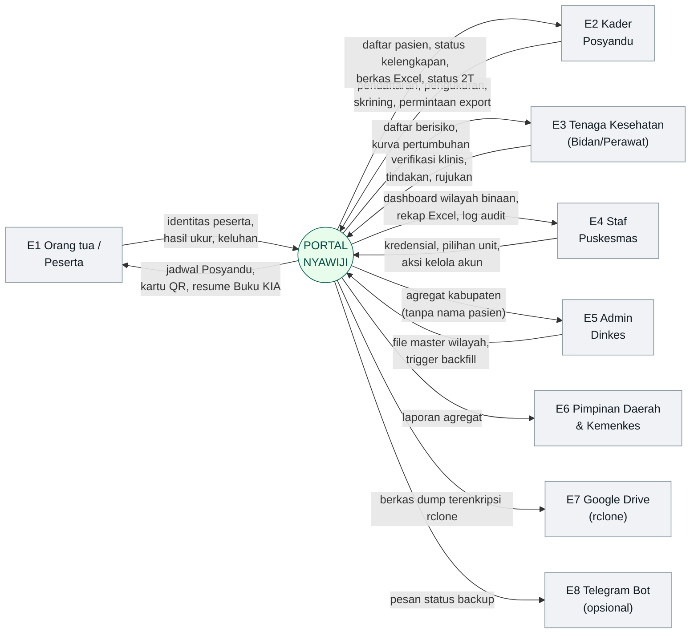
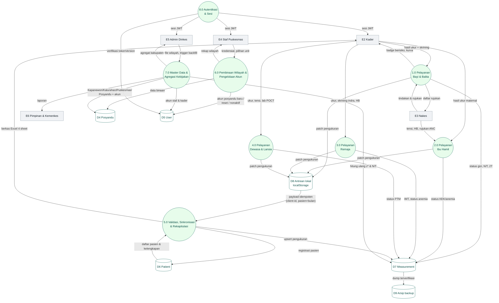
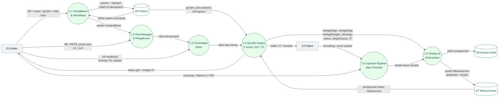
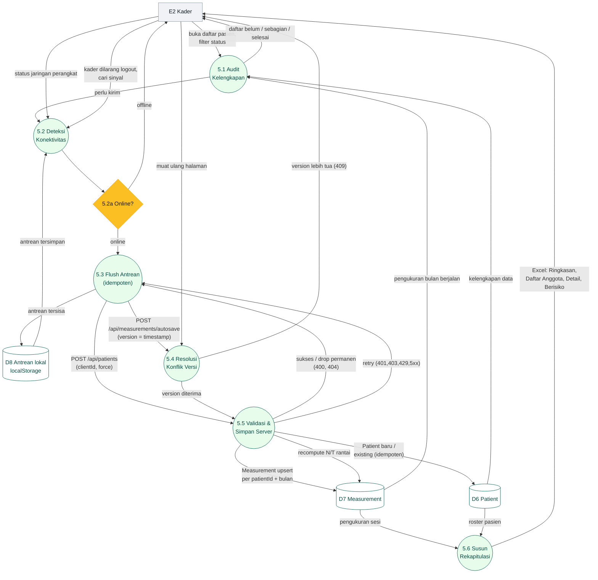

# DFD — Data Flow Diagram Portal Nyawiji

Aliran data sistem untuk **developer Dinas Kesehatan Kabupaten Gunungkidul**.

- **Notasi**: Yourdon/DeMarco, direpresentasikan dengan Mermaid (render otomatis di GitHub).
- **Level**: Context Diagram (Level 0), DFD Level 1 (proses + data store), DFD Level 2
  (dua alur paling kritikal).
- **Sumber**: `src/app/api/**`, `prisma/schema.prisma`, `PROJECT_POSYANDU/03_OUTPUT/BUSINESS_PROCESS_NARRATIVE.md`.

---

## 1. Notasi & Konvensi

| Elemen DFD | Simbol Mermaid | Keterangan |
|---|---|---|
| Entitas eksternal | `[ ]` abu | di luar batas sistem |
| Proses | `( )` hijau muda | nomor proses = level (mis. `1.0`) |
| Data store | `[( )]` | tabel database / penyimpanan klien |
| Aliran data | `-->` berlabel | arah + nama data |
| Batas sistem | `subgraph` | Portal Nyawiji |

> Catatan: notasi DeMarco menggambar data store sebagai dua garis sejajar. Mermaid
> tidak memilikinya, jadi dipakai silinder (konvensi umum lain). Yang penting
> konsisten dan terbaca.

### Entitas eksternal

| Kode | Entitas | Peran |
|---|---|---|
| E1 | Orang tua / Peserta | membawa balita, bumil, remaja, warga dewasa/lansia |
| E2 | Kader Posyandu | pengguna utama; input data lapangan |
| E3 | Tenaga Kesehatan (Bidan/Perawat) | verifikasi klinis, rujukan, imunisasi |
| E4 | Staf Puskesmas | supervisi wilayah, kelola akun, rekap |
| E5 | Admin Dinkes | master data, backfill, agregat kebijakan |
| E6 | Pimpinan Daerah & Kemenkes | penerima laporan agregat |
| E7 | Google Drive (rclone) | tujuan cadangan backup luar ruang |
| E8 | Telegram Bot (opsional) | notifikasi kegagalan backup |

### Data store

| Kode | Nama | Sumber |
|---|---|---|
| D1 | Kapanewon | `prisma/schema.prisma` model `Kapanewon` |
| D2 | Kalurahan | model `Kalurahan` |
| D3 | HealthCenter (Puskesmas) | model `HealthCenter` |
| D4 | Posyandu | model `Posyandu` |
| D5 | User (akun & tokenVersion) | model `User` |
| D6 | Patient | model `Patient` |
| D7 | Measurement | model `Measurement` |
| D8 | Antrean lokal peramban (`localStorage`) | `src/lib/offline-sync.ts` (di perangkat kader) |
| D9 | Arsip backup | `scripts/backup-db.sh` (`/var/backups/posyandu` + Drive) |

---

## 2. Context Diagram (Level 0)

---

## 3. DFD Level 1

Tujuh proses bisnis utama + satu proses pendukung (autentikasi). Penomoran
mengikuti `BUSINESS_PROCESS_NARRATIVE.md`.

**Aturan DFD yang dipatuhi:**

- Tidak ada *black hole* (proses tanpa output) atau *miracle* (output tanpa input).
- Aliran hanya antar-level yang sah: Entitas ↔ Proses ↔ Data Store. Entitas tidak
  pernah menulis langsung ke data store.
- D8 (antrean `localStorage`) berada **di sisi klien** tetapi tetap digambar sebagai data store
  karena menjadi penampung sementara sebelum sinkronisasi.

---

## 4. DFD Level 2

### 4.1 Proses 1.0 — Pelayanan Bayi & Balita (dekomposisi)

### 4.2 Proses 5.0 — Validasi & Sinkronisasi Offline-First

---

## 5. Kamus Aliran Data

| Aliran | Dari → Ke | Muatan |
|---|---|---|
| Data peserta | E1/E2 → 1.1 | nama, tanggal lahir, jenis kelamin, wali, no. HP, alamat, `isPregnant` |
| Hasil ukur | E2 → 1.2/2.0/3.0/4.0 | BB (kg), TB/PB (cm), posisi ukur, LK, LiLA, lingkar perut, tensi, lab POCT, usia kehamilan, skrining, `exclusiveBreastfeeding` |
| Status gizi | 1.4 → D7 | `zWeightAge`, `zHeightAge`, `zWeightHeight`, `zBmiAge`, `underweightStatus`, `stuntingStatus`, `wastingStatus`, `growthRefVersion` |
| Progres berat | 1.4 → D7 | `weightGain`, `weightStatus` (`NAIK`/`TIDAK_NAIK`), `weightFaltering2T` |
| Patch pengukuran | 1.0–4.0 → D8 | `kind`, `id`, `patientId`, `posyanduId`, `clientId`, `payload`, `timestamp` |
| Payload sinkron | D8 → 5.3 | isi patch + `version` = `floor(timestamp/1000)` |
| Respon sinkron | 5.5 → 5.3 | `200 ok` / `400,404` (drop) / `401,403` (retry) / `409` (konflik) / `429,5xx` (retry) |
| Sesi JWT | 8.0 → E2/E4/E5 | `userId`, `username`, `name`, `role`, `healthCenterId`, `posyanduId`, `tokenVersion` |
| Master wilayah | E5 → 7.0 | baris Puskesmas, Kalurahan, Padukuhan, Posyandu |
| Berkas rekap | 5.6/6.0/7.0 → E2/E4/E5 | workbook `.xlsx` (sheet Ringkasan, Daftar Anggota, Detail Pengukuran, Daftar Berisiko) |
| Dump backup | D7 → D9 | arsip `pg_dump -Fc` digzip, retensi 7 harian + 6 bulanan |

---

## 6. Catatan Privasi pada Aliran Data

| Peran | Boleh menerima | Tidak boleh |
|---|---|---|
| Posyandu | data per pasien milik unitnya | data unit lain |
| Puskesmas | data per pasien seluruh posyandu binaan | data di luar binaannya |
| Dinkes | agregat per unit/kabupaten | **nama / identitas pasien** |

Penegakan ada di API (`src/lib/patient-scope.ts`, `src/lib/stats-access.ts`),
bukan sekadar menyembunyikan tombol di UI.
