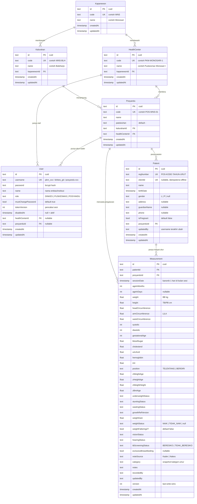

# ERD — Entity Relationship Diagram Portal Nyawiji

Model data Portal Nyawiji. Sumber tunggal: **`prisma/schema.prisma`**.

- **Database**: PostgreSQL (sebelumnya SQLite — lihat `docs/ded/RUNBOOK-MIGRASI-POSTGRESQL.md`).
- **ORM**: Prisma Client (`prisma-client-js`).
- **Konvensi**: nama tabel & kolom mengikuti nama model/field Prisma apa adanya
  (`"Measurement"`, `"sessionDate"`), sehingga **identifier camelCase wajib di-quote**
  saat menulis SQL mentah di PostgreSQL.

---

## 1. Diagram Relasi



---

## 2. Pemetaan Tipe Prisma → PostgreSQL

| Prisma | PostgreSQL | Catatan |
|---|---|---|
| `String` | `text` | |
| `Int` | `integer` | |
| `Float` | `double precision` | |
| `Boolean` | `boolean` | |
| `DateTime` | `timestamp(3)` tanpa zona | Prisma menyimpan dalam UTC |
| `DateTime?` | `timestamp(3)` nullable | |
| `@id @default(cuid())` | `text` PK | ID berupa string CUID |

**Penting untuk query mentah** (`src/lib/analytics.ts`):

- Nama tabel/kolom camelCase **wajib di-quote**: `"Measurement"`, `"sessionDate"`,
  `"posyanduId"`. Tanpa quote, PostgreSQL me-lowercase dan kolom tidak ditemukan.
- `DateTime` disimpan UTC. Untuk mengelompokkan per bulan waktu Jakarta:
  `to_char("sessionDate" AT TIME ZONE 'UTC' AT TIME ZONE 'Asia/Jakarta', 'YYYY-MM')`.
  Ini menggantikan `strftime(..., 'unixepoch', 'localtime')` milik SQLite.

---

## 3. Kunci Unik, Indeks & Kunci Asing

| Model | Kunci / Indeks | Tujuan |
|---|---|---|
| `Kapanewon` | `code` unik | referensi wilayah |
| `Kalurahan` | `code` unik | referensi wilayah |
| `HealthCenter` | `code` unik | referensi Puskesmas |
| `Posyandu` | `code` unik | referensi Posyandu |
| `User` | `username` unik | login staf |
| `Patient` | `regNumber` unik | nomor registrasi hierarkis |
| `Patient` | `clientId` unik (nullable) | idempotensi registrasi offline |
| `Measurement` | **unik gabungan** (`patientId`, `sessionDate`) | satu pasien satu pengukuran per sesi |
| `Measurement` | indeks `sessionDate` | agregasi rentang bulan |

### Aturan penghapusan (*referential actions*)

| Relasi | Aksi | Konsekuensi |
|---|---|---|
| `Kalurahan` → `Kapanewon` | `Cascade` | hapus kapanewon menghapus kalurahan |
| `HealthCenter` → `Kapanewon` | `Restrict` | kapanewon tidak bisa dihapus bila masih punya Puskesmas |
| `Posyandu` → `Kalurahan` | `Restrict` | kalurahan tidak bisa dihapus bila masih punya Posyandu |
| `Posyandu` → `HealthCenter` | `Cascade` | hapus Puskesmas menghapus Posyandu binaannya |
| `User` → `HealthCenter` | `Cascade` | hapus Puskesmas menghapus akun stafnya |
| `User` → `Posyandu` | `Cascade` | hapus Posyandu menghapus akun kadernya |
| `Patient` → `Posyandu` | `Cascade` | hapus Posyandu menghapus pasiennya |
| `Measurement` → `Patient` | `Cascade` | hapus pasien menghapus riwayat ukurnya |
| `Measurement` → `Posyandu` | `Cascade` | hapus Posyandu menghapus pengukurannya |

> **Batas pengaman di aplikasi.** Meski level basis data memakai `Cascade`, API
> **menolak** penghapusan Posyandu yang sudah punya pasien/pengukuran dengan
> `409` (`src/app/api/posyandus/[posyanduId]/route.ts:98-110`). Untuk unit berisi
> data, satu-satunya tindakan adalah **Nonaktifkan Akun** — riwayat kesehatan warga
> tidak boleh hilang.

---

## 4. Alur Nilai Turunan (derived fields)

Kolom yang **tidak diisi manual** tetapi dihitung sistem:

| Kolom | Dihitung saat | Rumus / sumber |
|---|---|---|
| `Measurement.ageInMonths` | simpan pengukuran | `calculateAge(birthDate, sessionDate)` |
| `Measurement.ageInDays` | simpan pengukuran | selisih hari, minimal 0 |
| `Measurement.imt` | simpan pengukuran | `BB / (TB/100)^2` |
| `Measurement.z*` (BB/U, TB/U, BB/TB, IMT/U) | simpan pengukuran | LMS Permenkes 2/2020, hanya usia 0–60 bulan |
| `Measurement.*Status` | simpan pengukuran | kategori dari z-score |
| `Measurement.weightGain` / `weightStatus` | simpan + recompute | delta BB vs pengukuran valid sebelumnya |
| `Measurement.weightFaltering2T` | recompute | dua `TIDAK_NAIK` berturut-turut |
| `Measurement.category` | simpan + backfill | kategori siklus hidup dari umur |
| `Patient.regNumber` | registrasi | `POS-<kode posyandu>-<tahun>-<urut 4 digit>` |

Perhitungan ulang massal tersedia untuk Dinkes:
`POST /api/dinkes/backfill-growth` (lihat `docs/ded/FLOWCHART.md` §4.6).

---

## 5. Contoh Query Agregasi yang Benar (PostgreSQL)

Coverage per Posyandu per bulan (dipakai dashboard):

```sql
SELECT
  to_char(m."sessionDate" AT TIME ZONE 'UTC' AT TIME ZONE 'Asia/Jakarta', 'YYYY-MM') AS ym,
  m."posyanduId" AS "unitId",
  COUNT(DISTINCT m."patientId") AS numerator
FROM "Measurement" m
WHERE m."sessionDate" >= $1   -- parameter Date
  AND m."sessionDate" <  $2
GROUP BY ym, m."posyanduId";
```

Salah (peninggalan SQLite, tidak jalan di PostgreSQL):

```sql
-- tabel tidak di-quote, epoch-ms, strftime
SELECT strftime('%Y-%m', m.sessionDate/1000, 'unixepoch', 'localtime') AS ym
FROM Measurement m;
```

---

## 6. Volume Data Acuan

| Entitas | Perkiraan | Sumber |
|---|---|---|
| Kapanewon | 18 | `prisma/seed.js` |
| Puskesmas | 30 | `daftarposyandu.csv` |
| Posyandu | ±1.400 | `daftarposyandu.csv` |
| Akun kader | 1 per Posyandu | dibuat saat import/registrasi |
| Pasien & Measurement | tumbuh tiap bulan per Posyandu | akumulatif |

Indeks `(patientId, sessionDate)` dan indeks `sessionDate` menjaga query agregasi
tetap cepat saat data bertambah.

Dokumen terkait: `docs/ded/DFD.md`, `docs/ded/FLOWCHART.md`, `docs/ded/DED.md`.
