# FLOWCHART — Portal Nyawiji

Diagram alur untuk **developer Dinas Kesehatan Kabupaten Gunungkidul** yang akan
meneruskan/mengoperasikan aplikasi.

- **Format**: Mermaid (ter-render otomatis di GitHub, VS Code, dan GitLab). Tidak butuh alat tambahan.
- **Sumber**: kode di repo ini — `PROJECT_POSYANDU/01_DATA_INPUT/*.md`,
  `PROJECT_POSYANDU/03_OUTPUT/BUSINESS_PROCESS_NARRATIVE.md` (7 proses bisnis,
  70 aktivitas, selaras 5 Langkah Posyandu ILP + Permenkes 2/2020), `prisma/schema.prisma`,
  dan route API di `src/app/api/**`.
- **Aturan penulisan**: setiap kotak pada alur sistem dapat ditelusuri ke file kode
  (lihat [Referensi kode](#referensi-kode)).

> Catatan Mermaid: Mermaid tidak punya *swimlane* vertikal resmi. Kolom pelaksana
> disimulasikan dengan `subgraph` per aktor. Bila nanti developer kabupaten butuh
> versi yang bisa di-drag, konversikan ke draw.io.

---

## 1. Legenda & Aktor

### Simbol

| Simbol | Arti | Contoh |
|---|---|---|
| `(( ))` hijau | Mulai (*Start Event*) | kedatangan peserta |
| `(( ))` teal | Selesai (*End Event*) | sesi ditutup |
| `[ ]` abu | Aktivitas / task manual | penimbangan BB |
| `[ ]` hijau muda | Aktivitas otomatis oleh sistem | hitung Z-score |
| `{ }` kuning | Keputusan (*Gateway*) | normal vs berisiko |
| `{ }` merah | Keputusan risiko / penolakan | akses ditolak |
| `[( )]` | Penyimpanan data (*Data Store*) | database, antrean `localStorage` |
| garis putus-putus | Aliran data ke penyimpanan/laporan | simpan / export |

### Aktor

| Aktor | Level | Ringkas |
|---|---|---|
| Orang tua / Peserta | — | membawa balita, ibu hamil, remaja, warga dewasa/lansia |
| Kader Posyandu | Posyandu | pendaftaran, pengukuran, input data, cetak QR, export |
| Tenaga Kesehatan (Bidan/Perawat) | Puskesmas (turun ke Posyandu) | verifikasi klinis, imunisasi, rujukan |
| Staf Puskesmas | Kapanewon | kelola akun posyandu binaan, supervisi read-only, rekap wilayah |
| Admin Dinkes | Kabupaten | master data wilayah, akun puskesmas, backfill, agregat kebijakan |
| Sistem Portal Nyawiji | — | growth engine, offline-sync, agregasi, export |

### Rekayasa kunci yang mempengaruhi semua alur

1. **Sesi = 1 bulan.** Satu pasien maksimal satu pengukuran per bulan. Tanggal kanonik
   `YYYY-MM-01` (lihat `CONTEXT.md`).
2. **Offline-first.** Input disimpan di peramban (`localStorage`) lebih dulu, dikirim menyusul;
   dedupe per `posyandu + pasien + bulan`.
3. **Fail-closed scope.** Sesi tanpa cakupan wilayah **ditolak**, bukan dikembalikan
   tanpa filter (`src/lib/patient-scope.ts`, `src/lib/stats-access.ts`).
4. **Privasi berjenjang.** Nama pasien: Posyandu & Puskesmas saja. Dinkes agregat.

---

## 2. Overview — Siklus Hidup Data End-to-End

```mermaid
flowchart LR
    classDef start fill:#25d366,stroke:#128c7e,color:#fff
    classDef end1 fill:#075e54,stroke:#054c44,color:#fff
    classDef sys fill:#e7fceb,stroke:#075e54,color:#054c44
    classDef store fill:#f0f2f5,stroke:#075e54,color:#054c44
    classDef out fill:#fbbf24,stroke:#f59e0b,color:#0b141a

    A(("Peserta datang<br/>hari buka Posyandu")):::start
    B["Kader: pendaftaran<br/>scan QR / cari / daftar baru"]:::sys
    C["Kader: ukur & input<br/>BB, TB/PB, LK, LiLA, tensi, lab, skrining"]:::sys
    D["Growth Engine<br/>Z-score 4 indeks, N/T, 2T, kategori umur"]:::sys
    Q{"Ada temuan<br/>berisiko?"}:::out
    R["Nakes: konseling +<br/>rujukan ke Puskesmas"]:::out
    E[("Antrean lokal peramban<br/>localStorage (saat offline)")]:::store
    F[("Database server<br/>Kapanewon..Measurement")]:::store
    G["Agregasi per Posyandu<br/>cakupan, N/T, PTM, skrining"]:::sys
    H["Puskesmas: dashboard wilayah binaan<br/>+ rekap Excel (maks 30 unit / 20.000 baris)"]:::out
    I["Dinkes: agregat kabupaten<br/>(tanpa nama pasien)"]:::out
    J(("Laporan ke<br/>pimpinan daerah")):::end1

    A --> B --> C --> D --> Q
    Q -- tidak --> E
    Q -- ya --> R --> E
    E -. sync otomatis saat online .-> F
    F --> G --> H --> I --> J
```

---

## 3. Proses Bisnis (7 Proses)

### Proses 1 — Pelayanan Bayi & Balita (0–60 bulan, lanjut Apras s.d. 83 bulan)

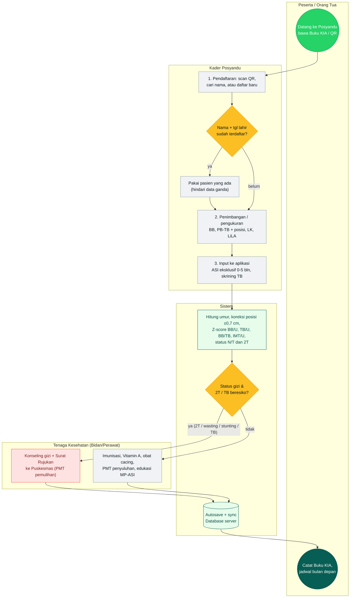

**Ambang & aturan:** status gizi hanya 0–60 bulan (61–83 bulan: BB/TB tetap wajib,
Z-score & N/T `null`). 2T = dua kali `TIDAK_NAIK` berturut → wajib rujuk.
Rujukan tercatat di sheet *Daftar Berisiko*.

### Proses 2 — Pelayanan Ibu Hamil (Bumil)

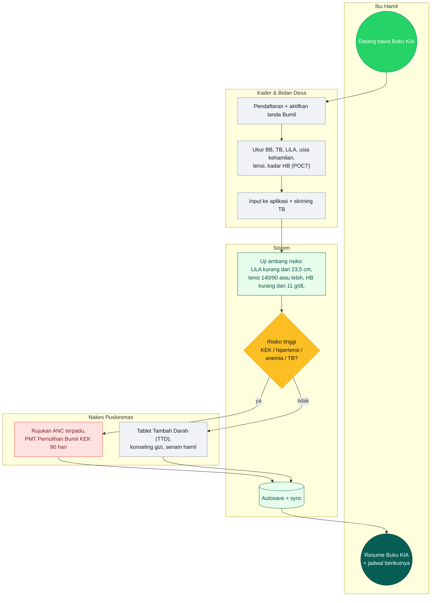

**Darurat:** sistolik ≥ 160 atau diastolik ≥ 110 mmHg → rujukan darurat ke IGD.

### Proses 3 — Pelayanan Usia Sekolah & Remaja (7–17 tahun)

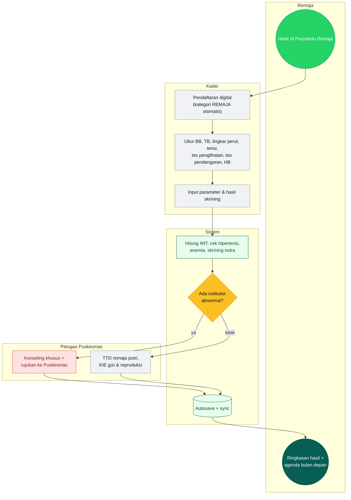

**Darurat:** HB < 8 g/dL → koordinasi orang tua + rujuk dokter Puskesmas.

### Proses 4 — Pelayanan Usia Produktif & Lansia (PTM)

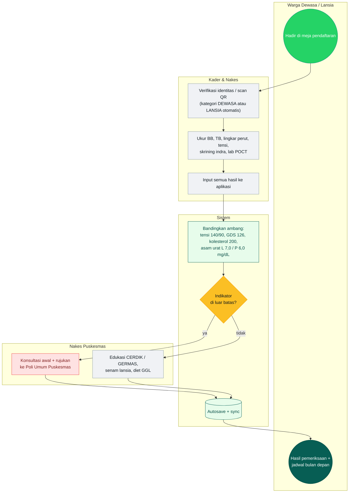

**Krisis:** sistolik ≥ 180 atau diastolik ≥ 120 mmHg, atau GDS ≥ 300 mg/dL →
stabilisasi awal + rujuk UGD.

### Proses 5 — Validasi, Sinkronisasi Offline-First & Rekapitulasi

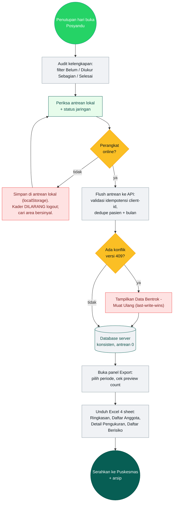

### Proses 6 — Pembinaan Wilayah & Pengelolaan Akun oleh Puskesmas

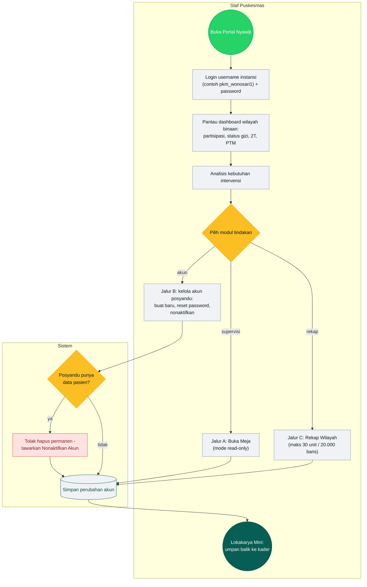

**Batas wewenang:** Puskesmas hanya boleh mereset akun Posyandu di
`healthCenterId` yang sama. Reset menaikkan `tokenVersion` → semua sesi lama tercabut.
Penonaktifan juga menaikkan `tokenVersion` dan menolak login berikutnya.

### Proses 7 — Tata Kelola Master Data & Agregasi Kebijakan (Dinkes)

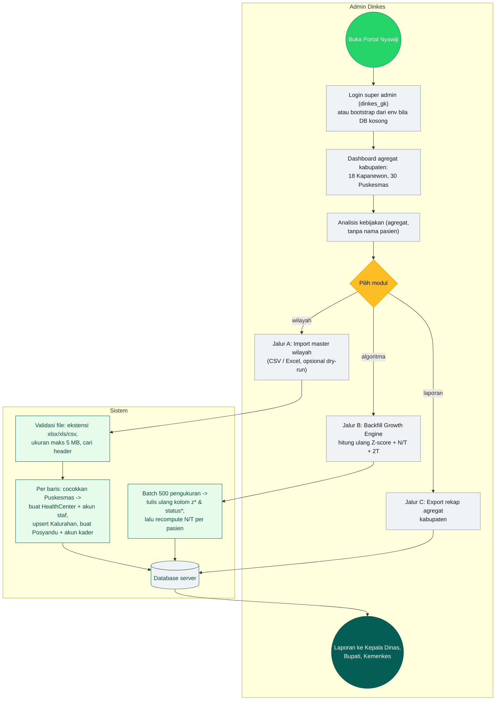

**Idempotensi import:** Posyandu yang sudah ada (kombinasi Puskesmas + Kalurahan +
nama + padukuhan) dilewati; aman dijalankan ulang saat file wilayah berubah.

---

## 4. Alur Sistem Teknis (6 Alur)

### 4.1 Login Kader (cascade) & Aktivasi Wajib Ganti Password

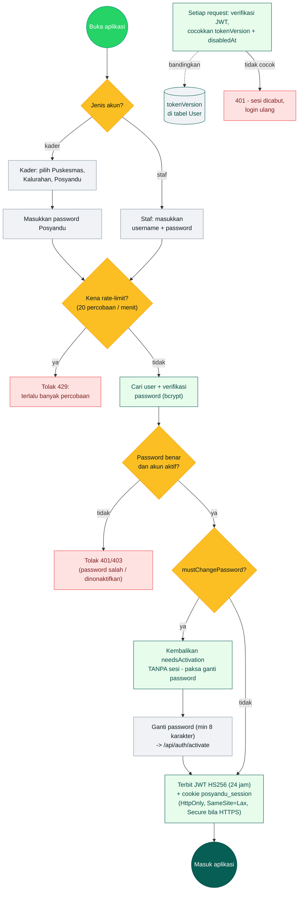

**Kunci keamanan:** `tokenVersion` naik saat ganti password, reset oleh admin, atau
akun dinonaktifkan → seluruh sesi lama otomatis mati.

### 4.2 Autosave → Antrean Lokal (localStorage) → Sinkronisasi

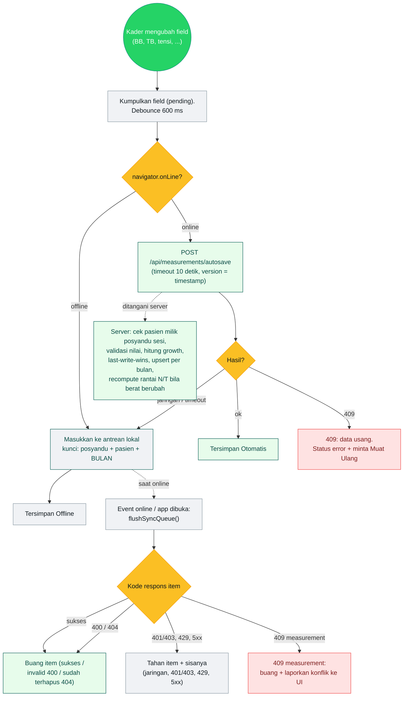

**Detail penting** (`src/lib/offline-sync.ts`):

- Kunci dedupe pengukuran = `m:posyanduId:patientId:YYYY-MM`. Edit pada dua tanggal
  berbeda di **bulan sama** digabung; bulan berbeda tidak. Karena itu, data yang
  diinput saat pemeliharaan tidak hilang selama kader **tidak logout**.
- Item yang gagal (bukan permanen) **ditahan** dan seluruh antrean di belakangnya
  ikut ditahan sampai berhasil — mencegah urutan terbalik.
- Registrasi pasien offline pakai `clientId` (UUID) sebagai idempotensi: retry tidak
  membuat dobel.

### 4.3 Export Excel per Peran

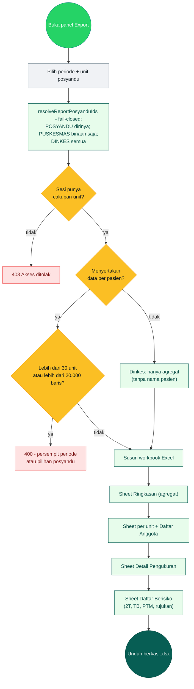

### 4.4 Reset Password Kader oleh Puskesmas/Dinkes

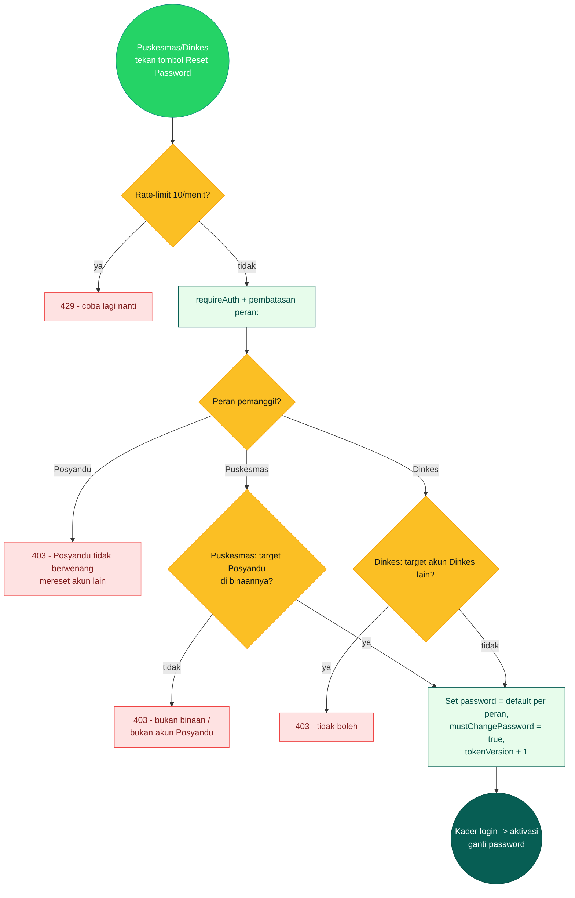

### 4.5 Import Master Wilayah (Dinkes)

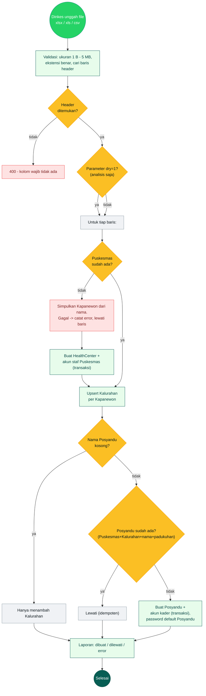

**Normalisasi nama** (`src/lib/names.ts`): angka romawi dipertahankan kapital
(`Puskesmas Wonosari II`, bukan `... Ii`). Akun staf dibuat otomatis dari nama
(contoh `pkm_semanu1`).

### 4.6 Backfill Growth Engine (Dinkes)

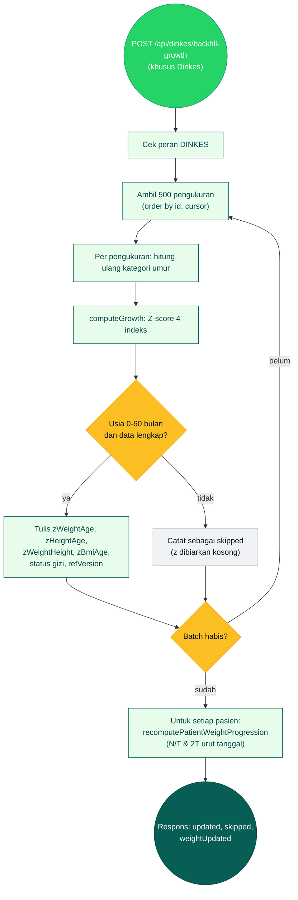

**Idempoten:** aman dijalankan berulang. Dipakai saat standar antropometri berubah
atau setelah kolom turunan ditambahkan.

---

## 5. Matriks Hak Akses

Ditegakkan di API (`src/lib/api-auth.ts`, `src/lib/patient-scope.ts`,
`src/lib/stats-access.ts`), bukan hanya menyembunyikan tombol.

| Aksi | Posyandu (Kader) | Puskesmas (Staf) | Dinkes (Admin) |
|---|---|---|---|
| Lihat data pasien bernama | Posyandu sendiri | Semua posyandu binaan | **Tidak** (agregat saja) |
| Tambah / ubah pasien | Ya | **Read-only** | Tidak |
| Input pengukuran | Ya | Read-only (Buka Meja) | Tidak |
| Export data per pasien | Posyandu sendiri | Binaan, maks 30 unit / 20.000 baris | Tidak |
| Export agregat | Ya (unit sendiri) | Ya (binaan) | Ya (kabupaten, s/d 24 bulan) |
| Buat / nonaktifkan Posyandu | Tidak | Ya (binaan) | Ya (semua) |
| Reset password | Tidak | Posyandu binaan | Puskesmas & Posyandu |
| Import master wilayah | Tidak | Tidak | Ya |
| Backfill growth engine | Tidak | Tidak | Ya |
| Kelola Kapanewon/Kalurahan | Tidak | Tidak | Ya (via import) |

---

## 6. Lampiran — Pemetaan Simbol BPMN ke Mermaid

| BPMN | Mermaid di dokumen ini |
|---|---|
| Start Event | `((Mulai))` dengan `classDef start` |
| End Event | `((Selesai))` dengan `classDef end1` |
| Task manual | `[ ]` (`classDef act`) |
| Task sistem | `[ ]` hijau muda (`classDef sys`) |
| Exclusive Gateway | `{ }` kuning (`classDef dec`) |
| Peringatan / jalur risiko | `{ }` atau `[ ]` merah (`classDef risk`) |
| Data Store | `[( )]` (`classDef store`) |
| Sub Process | subgraph tersendiri |
| Sequence Flow | `-->` atau `-->|label|` |
| Association (ke penyimpanan) | `-.->` |
| Swimlane / Pool | `subgraph` per aktor |

---

## Referensi kode

| Alur | File |
|---|---|
| Kunci sesi & JWT | `src/lib/session.ts` |
| Verifikasi sesi + peran | `src/lib/api-auth.ts` |
| Cakupan pasien (fail-closed) | `src/lib/patient-scope.ts` |
| Batas export | `src/lib/export-limits.ts` |
| Offline-sync & autosave | `src/lib/offline-sync.ts` |
| Simpan pengukuran (server) | `src/app/api/measurements/autosave/route.ts` |
| Registrasi pasien + dedupe | `src/app/api/patients/route.ts` |
| Growth engine | `src/lib/growth/` |
| Progres N/T & 2T | `src/lib/weight-progression-db.ts` |
| Import wilayah | `src/app/api/dinkes/import/route.ts` |
| Backfill | `src/app/api/dinkes/backfill-growth/route.ts` |
| Reset password | `src/app/api/auth/reset-password/route.ts` |
| Status akun posyandu | `src/app/api/posyandus/[posyanduId]/status/route.ts` |
| Export Excel | `src/app/api/stats/report/route.ts`, `src/lib/member-export.ts` |
| Skema database | `prisma/schema.prisma` |

Dokumen terkait: `docs/ded/DFD.md` (aliran data), `docs/ded/ERD.md` (relasi tabel),
`docs/ded/DED.md` (desain teknis), `CONTEXT.md` (glosarium domain).
